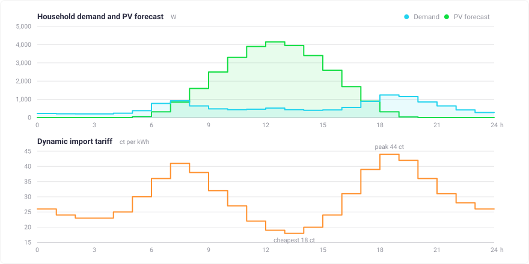
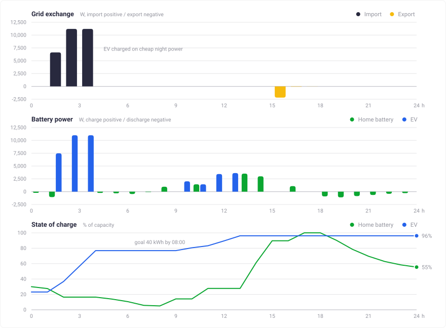
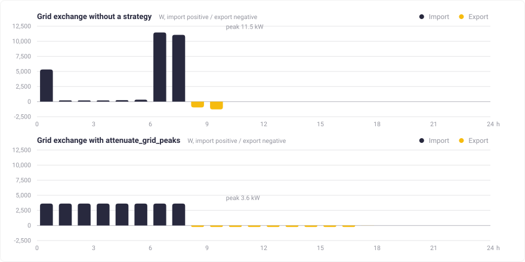

# optimizer

[](https://pkg.go.dev/github.com/evcc-io/optimizer)

An HTTP service that plans the cheapest way to run a home energy system over the next hours or days.

Given a PV forecast, the expected household demand, dynamic grid prices and a description of every battery in the house, it returns a per-time-step schedule: how much to import, how much to export, and how much to charge or discharge each battery. The problem is expressed as a Mixed Integer Linear Program and solved with CBC via [PuLP](https://github.com/coin-or/pulp).

Inspired by https://github.com/Akkudoktor-EOS/EOS/pull/462

## What it does

- **Maximizes economic benefit** over the horizon: grid import cost, export revenue, and the value of the energy left in the batteries at the end.
- **Handles many batteries at once** — home storage and EVs — each with its own capacity, power limits, priority and permission to charge from or discharge to the grid.
- **Respects charging goals**: an EV can be required to reach a given state of charge by a given time step, or to charge at a minimum power while it is plugged in.
- **Honours grid limits** for import and export power, and supports a demand rate charged on the highest power drawn beyond a threshold.
- **Never returns "infeasible" for a goal it cannot reach.** Goals, minimum charge demand and grid limits are soft constraints backed by penalties, so an over-constrained request still yields the best achievable schedule plus a flag telling you which limit was violated.
- **Optional strategies** break ties that cost nothing: charge before exporting, discharge before importing, or level grid peaks on the import side, the feed-in side, or both.

## Example

One day, hourly steps: a 10 kWh home battery, an EV that must reach 40 kWh by 08:00, a 4 kWp PV forecast, and a dynamic tariff between 18 and 44 ct/kWh.

<picture>
  <source media="(prefers-color-scheme: dark)" srcset="docs/img/example-input-dark.svg">
  
</picture>

The optimizer buys all 29 kWh of grid energy in the three cheapest hours of the night, filling the EV to its goal by 04:00 — four hours early, because energy later is more expensive. Midday PV surplus goes into the home battery instead of the grid, since `charge_before_export` makes self-consumption the tie-breaker. The 44 ct evening peak is then covered entirely from storage: after 04:00 the house imports nothing at all.

<picture>
  <source media="(prefers-color-scheme: dark)" srcset="docs/img/example-result-dark.svg">
  
</picture>

## Levelling grid peaks

Cheapest is not always kindest to the grid connection. The same house on a *flat* tariff — where nothing but the strategy decides when to charge — takes its 29 kWh at the full 11 kW in the last two hours before the EV deadline, and pushes the midday surplus out in two short bursts.

`attenuate_grid_peaks` penalizes the highest grid power over the horizon, on the import and the feed-in side. The same energy then arrives as a flat 3.6 kW plateau, and the feed-in peak drops from 1.3 kW to 0.25 kW. Nothing costs more — the connection just sees a calmer profile. `attenuate_demand_peaks` and `attenuate_feedin_peaks` do the same for one side only.

The maximum is a single value out of the horizon, which leaves one gap: a load spike the schedule cannot touch — an oven, a heat pump defrost — fixes it, and the penalty then has nothing left to win below it. Charging flat out against the spike scores the same as spreading the same energy over the window, and the solver may pick either.

<picture>
  <source media="(prefers-color-scheme: dark)" srcset="docs/img/example-peak-dark.svg">
  
</picture>

## How a request is solved

One request is up to five solver runs under one wall clock, `OPTIMIZER_TIME_LIMIT` (10 s in production). Each stage keeps what the previous one found unless it can improve on it without spending money. The request log carries where the clock went (`stages`), which path was taken (`path`), and what the tie break (`preferences`) and the continuity pass (`continuity`) did.

| Stage | Task | Runs when | Parameters |
|---|---|---|---|
| `build` | Build the MILP and scale its objective so the largest coefficient sits at `OBJECTIVE_TARGET`. | Always. | `OBJECTIVE_TARGET` 1e6 |
| `probe` | Solve cost and preferences together. Proven optimal means the tie is decided in one solve: path `joint`, nothing else runs on the money. | Unless `OPTIMIZER_PROBE_SECONDS` is 0. | `OPTIMIZER_PROBE_SECONDS`, default `PROBE_SHARE` 0.2 of the limit |
| `cost` | Money only, stopped on an absolute gap. Holds back a slice of the clock for the tie break instead of taking whatever is left. | The probe did not prove its answer: path `split`. | `OPTIMIZER_GAP_ABS` 0.01 currency, `PREFERENCE_TIME_SHARE` 0.25 of the limit reserved |
| `tie_break`, LP | Pin the binaries the cost stage chose and move only the continuous variables, under a bound that keeps the cost found. Milliseconds, so it runs whatever the clock says. If CBC calls the bound infeasible the slack is widened tenfold per retry. | Path `split` and a strategy is configured. | `OPTIMIZER_PREFERENCE_BUDGET` 0, `COST_BOUND_SLACK` 1e-5 up to `COST_BOUND_SLACK_CEILING` 1e-2, `COST_BOUND_TOLERANCE` 1e-4, `LP_PREFERENCE_TIME_LIMIT` 1 s |
| `tie_break`, MILP | Search the whole model under the same bound to beat the LP. Whichever is ahead is returned. | After the LP, clock permitting. | The reserved slice, capped at `MILP_PREFERENCE_TIME_LIMIT` 2.5 s; uncapped without a time limit |
| `continuity` | Fewest charge starts for batteries with `c_min > 0`, bounded by the cost, the preference value and each levelled grid peak already reached. A preference, not a guarantee: prices, charge demands and grid shaping still win, and power may vary within a session. | A battery has more than one charging session, and the solve so far took less than the stage may spend. | `CONTINUITY_TIME_LIMIT` 1 s, `CONTINUITY_TOLERANCE` 1e-5 |

A schedule the solver stopped on at the limit is reported as `Feasible` rather than `Optimal`. A solve that comes back off the integers is refused and reported as `Not Solved`.

## API

`POST /optimize/charge-schedule` takes the whole problem as one JSON document and returns the schedule. `GET /optimize/health` is the liveness probe. Every field is documented in [`openapi.yaml`](openapi.yaml).

```jsonc
{
  "strategy": { "charging_strategy": "charge_before_export" },
  "grid": { "p_max_exp": 7000 },                                             // W
  "batteries": [
    {
      "s_capacity": 52000, "s_max": 50000, "s_min": 0, "s_initial": 12000,   // Wh
      "c_min": 1380, "c_max": 11000, "d_max": 0,                             // W
      "s_goal": [0, 0, 0, 0, 0, 0, 0, 40000, 0, 0, 0, 0],                    // Wh per step
      "charge_from_grid": true,
      "p_a": 0.00022                                     // value of stored energy, per Wh
    }
  ],
  "time_series": {
    "dt": [3600, 3600, 3600, 3600, 3600, 3600, 3600, 3600, 3600, 3600, 3600, 3600],
    "gt": [230, 210, 205, 205, 240, 380, 780, 920, 640, 480, 430, 460],   // demand, Wh
    "ft": [0, 0, 0, 0, 0, 60, 320, 850, 1600, 2500, 3300, 3900],          // PV forecast, Wh
    "p_N": [0.00026, 0.00024, 0.00023, 0.00023, 0.00025, 0.00030,
            0.00036, 0.00041, 0.00038, 0.00032, 0.00027, 0.00022],        // import, per Wh
    "p_E": [0.00008, 0.00008, 0.00008, 0.00008, 0.00008, 0.00008,
            0.00008, 0.00008, 0.00008, 0.00008, 0.00008, 0.00008]         // export, per Wh
  }
}
```

The response carries `status`, the `objective_value`, `grid_import` / `grid_export` per step, `charging_power` / `discharging_power` / `state_of_charge` per battery, and `limit_violations` together with the `grid_import_overshoot` and `grid_export_overshoot` series.

Time steps do not have to be equally long: `dt` is given per step, so a schedule can be fine grained for the next hour and coarse for tomorrow.

A small Go client for sending requests to a running service lives in [`cmd/client.go`](cmd/client.go); it prints the request, the resulting schedule and the objective value:

```sh
jq .request test_cases/024-attenuate-demand-peaks.json | go run ./cmd
```

## Development

Optimizer relies on `uv` and `make` being available.
Installation instructions for `uv` [can be found here](https://docs.astral.sh/uv/getting-started/installation/).

Once `uv` and `make` are available on the PATH, you can run `make run` to set up the project environment and run the optimizer service.

Linting and formatting is run with `make lint`.
The test suite is run with `make test`.
To add a new dependency to the project, run `uv add <dependency>`.
To upgrade all depdendencies to their latest version, run `make upgrade`.

To make sure that your contributions pass the CI pipeline, run `make lint` and `make test` before comitting or pushing your code.

If you are using VSCode, we recommend the [Python](https://marketplace.visualstudio.com/items?itemName=ms-python.python), [autopep8](https://marketplace.visualstudio.com/items?itemName=ms-python.autopep8), and [ruff](https://marketplace.visualstudio.com/items?itemName=charliermarsh.ruff) extensions.
Set up `autopep8` as your formatter for Python files.
