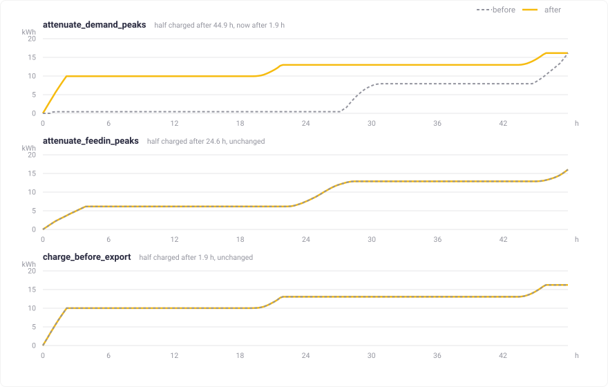

# optimizer

[](https://pkg.go.dev/github.com/evcc-io/optimizer)

An HTTP service that plans the cheapest way to run a home energy system over the next hours or days.

Given a PV forecast, the expected household demand, dynamic grid prices and a description of every battery in the house, it returns a per-time-step schedule: how much to import, how much to export, and how much to charge or discharge each battery. The problem is expressed as a Mixed Integer Linear Program and solved with CBC via [PuLP](https://github.com/coin-or/pulp).

Inspired by https://github.com/Akkudoktor-EOS/EOS/pull/462

## What it does

- **Maximizes economic benefit** over the horizon: grid import cost, export revenue, and the value of the energy left in the batteries at the end.
- **Handles many batteries at once** — home storage and EVs — each with its own capacity, power limits, priority and permission to charge from or discharge to the grid.
- **Respects charging goals**: an EV can be required to reach a given state of charge by a given time step, or to charge at a minimum power while it is plugged in.
- **Honours grid limits** for import and export power, and supports a demand rate charged on the highest power drawn beyond a threshold.
- **Never returns "infeasible" for a goal it cannot reach.** Goals, minimum charge demand and grid limits are soft constraints backed by penalties, so an over-constrained request still yields the best achievable schedule plus a flag telling you which limit was violated.
- **Optional strategies** break ties that cost nothing: level grid peaks on the import side, the feed-in side, or both, and discharge before importing. Independently of those, `battery_first` fills the batteries as early as the rest of the model allows.

## Example

One day, hourly steps: a 10 kWh home battery, an EV that must reach 40 kWh by 08:00, a 4 kWp PV forecast, and a dynamic tariff between 18 and 44 ct/kWh.

<picture>
  <source media="(prefers-color-scheme: dark)" srcset="docs/img/example-input-dark.svg">
  
</picture>

The optimizer buys all 29 kWh of grid energy in the three cheapest hours of the night, filling the EV to its goal by 04:00 — four hours early, because energy later is more expensive. Midday PV surplus goes into the home battery instead of the grid, since `battery_first` makes self-consumption the tie-breaker. The 44 ct evening peak is then covered entirely from storage: after 04:00 the house imports nothing at all.

<picture>
  <source media="(prefers-color-scheme: dark)" srcset="docs/img/example-result-dark.svg">
  
</picture>

## Levelling grid peaks

Cheapest is not always kindest to the grid connection. The same house on a *flat* tariff — where nothing but the strategy decides when to charge — takes its 29 kWh at the full 11 kW in the last two hours before the EV deadline, and pushes the midday surplus out in two short bursts.

`attenuate_grid_peaks` penalizes the highest grid power over the horizon and the distance of every single step from a common level, on the import and the feed-in side. The same energy then arrives as a flat 3.6 kW plateau, and the feed-in peak drops from 1.3 kW to 0.25 kW. Nothing costs more — the connection just sees a calmer profile. `attenuate_demand_peaks` and `attenuate_feedin_peaks` do the same for one side only.

The second term is what keeps the profile level where the peak is out of reach. A load spike the schedule cannot touch — an oven, a heat pump defrost — fixes the horizon maximum, and a peak penalty alone has nothing left to win below it: the cheapest way to charge is then flat out against the spike until the goal is met. Pricing the distance from a level instead spreads the same energy over the whole window, which is what a minimum square deviation from constant grid power asks for.

The level is placed freely, which leaves one gap: on a side that mostly rests at zero the level settles at zero too, and the term then only adds up the energy through that side — a plateau, a jagged profile and a single spike of the same energy score alike, and nothing below the peak tells them apart.

<picture>
  <source media="(prefers-color-scheme: dark)" srcset="docs/img/example-peak-dark.svg">
  
</picture>

A cap and a ramp limit say how high the grid profile may go, not when the batteries fill, and on a flat tariff nothing else decides it either — so a levelled day would otherwise return a schedule as arbitrary as no strategy at all, sitting on an empty battery for a day and a half. `battery_first` is the separate answer to that separate question: it holds the surplus back from the grid until the batteries have taken it, and pulls grid import forward for a battery that has no surplus to hold back. Because it is orthogonal, it combines with any `charging_strategy`, and on its own it is simply "fill the batteries first, shape nothing".

Filling sooner is not free on either side: a battery that is full by the first hour has no room left for the midday solar peak, and one filled at full power draws a taller import peak than one trickled. Attenuation therefore keeps priority — where the two disagree, the profile the request asked to level is the one that survives. On a side a strategy levels, that peak is the entire point. On a side it does not level, there is no peak worth protecting and filling early takes it outright. So `attenuate_demand_peaks` with `battery_first` fills at full rate and spends the feed-in peak nobody asked it to shave, `attenuate_feedin_peaks` keeps its feed-in peak and fills at the rate levelling leaves it, and `attenuate_grid_peaks` levels both sides and so protects both. No case pays real money for the difference.

<picture>
  <source media="(prefers-color-scheme: dark)" srcset="docs/img/example-early-dark.svg">
  
</picture>

## API

`POST /optimize/charge-schedule` takes the whole problem as one JSON document and returns the schedule. `GET /optimize/health` is the liveness probe. Every field is documented in [`openapi.yaml`](openapi.yaml).

```jsonc
{
  "strategy": { "battery_first": true },
  "grid": { "p_max_exp": 7000 },                                             // W
  "batteries": [
    {
      "s_capacity": 52000, "s_max": 50000, "s_min": 0, "s_initial": 12000,   // Wh
      "c_min": 1380, "c_max": 11000, "d_max": 0,                             // W
      "s_goal": [0, 0, 0, 0, 0, 0, 0, 40000, 0, 0, 0, 0],                    // Wh per step
      "charge_from_grid": true,
      "p_a": 0.00022                                     // value of stored energy, per Wh
    }
  ],
  "time_series": {
    "dt": [3600, 3600, 3600, 3600, 3600, 3600, 3600, 3600, 3600, 3600, 3600, 3600],
    "gt": [230, 210, 205, 205, 240, 380, 780, 920, 640, 480, 430, 460],   // demand, Wh
    "ft": [0, 0, 0, 0, 0, 60, 320, 850, 1600, 2500, 3300, 3900],          // PV forecast, Wh
    "p_N": [0.00026, 0.00024, 0.00023, 0.00023, 0.00025, 0.00030,
            0.00036, 0.00041, 0.00038, 0.00032, 0.00027, 0.00022],        // import, per Wh
    "p_E": [0.00008, 0.00008, 0.00008, 0.00008, 0.00008, 0.00008,
            0.00008, 0.00008, 0.00008, 0.00008, 0.00008, 0.00008]         // export, per Wh
  }
}
```

The response carries `status`, the `objective_value`, `grid_import` / `grid_export` per step, `charging_power` / `discharging_power` / `state_of_charge` per battery, and `limit_violations` together with the `grid_import_overshoot` and `grid_export_overshoot` series.

Time steps do not have to be equally long: `dt` is given per step, so a schedule can be fine grained for the next hour and coarse for tomorrow.

A small Go client for sending requests to a running service lives in [`cmd/client.go`](cmd/client.go); it prints the request, the resulting schedule and the objective value:

```sh
jq .request test_cases/024-attenuate-demand-peaks.json | go run ./cmd
```

## Development

Optimizer relies on `uv` and `make` being available.
Installation instructions for `uv` [can be found here](https://docs.astral.sh/uv/getting-started/installation/).

Once `uv` and `make` are available on the PATH, you can run `make run` to set up the project environment and run the optimizer service.

Linting and formatting is run with `make lint`.
The test suite is run with `make test`.
To add a new dependency to the project, run `uv add <dependency>`.
To upgrade all depdendencies to their latest version, run `make upgrade`.

To make sure that your contributions pass the CI pipeline, run `make lint` and `make test` before comitting or pushing your code.

If you are using VSCode, we recommend the [Python](https://marketplace.visualstudio.com/items?itemName=ms-python.python), [autopep8](https://marketplace.visualstudio.com/items?itemName=ms-python.autopep8), and [ruff](https://marketplace.visualstudio.com/items?itemName=charliermarsh.ruff) extensions.
Set up `autopep8` as your formatter for Python files.
